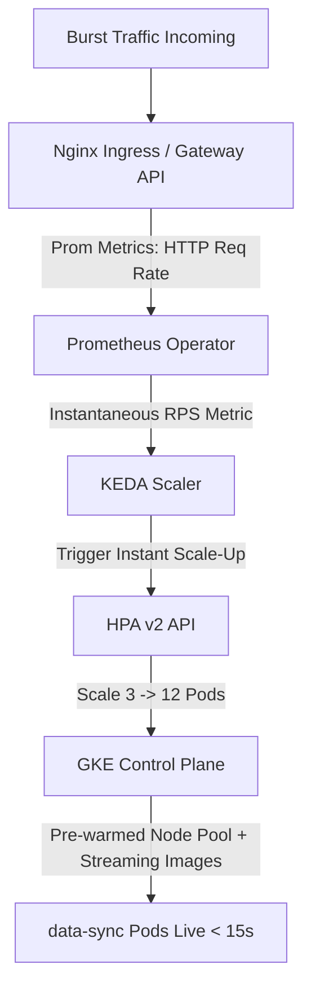
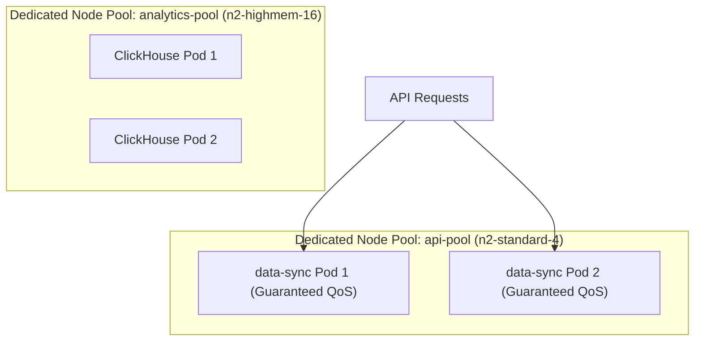
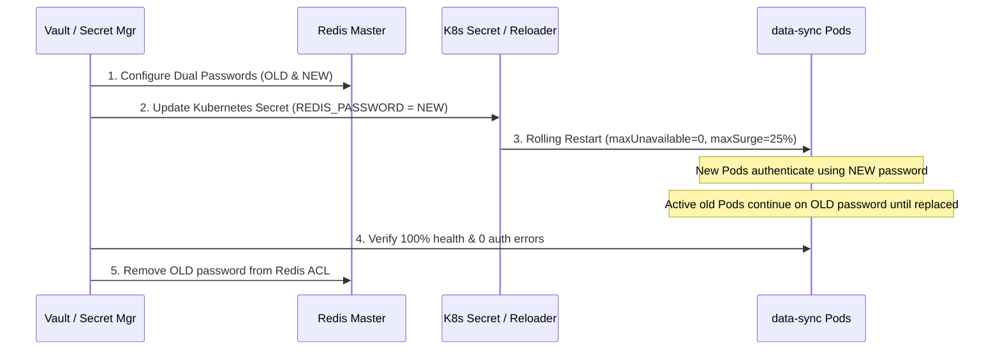

# Architectural Design & Strategy — BrightEdge data-sync Microservice

## Overview

The `data-sync` microservice is a critical FastAPI application handling peak volumes of **50 million requests/day (~2,000 req/s burst)**. To ensure high availability and sub-second latency, this document details strategies for:
1. Accelerating pod scale-out lag from ~90s to **<20s**.
2. Isolating workloads to eliminate noisy-neighbour latency spikes from ClickHouse pods.
3. Executing zero-downtime 90-day secret rotations for `REDIS_PASSWORD`.

---

## 1. Scaling Strategy: Reducing Scale-Out Lag to <20s

### Root Cause Analysis
The baseline 90-second delay occurs because standard CPU-based Kubernetes HPA relies on a reactive, multi-step pipeline:
$$\text{Metrics Scraping (30s)} \rightarrow \text{Metrics Server Aggregation (15s)} \rightarrow \text{HPA Evaluation (15s)} \rightarrow \text{GKE Node Auto-provisioning + Pod Pull/Boot (~30s)}$$
CPU utilization is a **lagging metric**; by the time CPU spikes, request queues are already overloaded and Redis connections time out.

### Proposed Multi-Tiered Solution



#### A. Event-Driven Autoscaling (KEDA)
- Replace standard CPU metrics with **leading indicators**: HTTP Request Rate (`http_requests_per_second`) from Prometheus or Nginx Ingress, and Redis active connection queue depth.
- **KEDA Prometheus Scaler Configuration**:
  - Target: 150 req/s per pod.
  - Threshold trigger scales pods *immediately* when traffic spikes begin.

#### B. Aggressive HPA Behavior Tuning
Configure `scaleUp` rules in `HorizontalPodAutoscaler` (`autoscaling/v2`):
```yaml
behavior:
  scaleUp:
    stabilizationWindowSeconds: 0
    selectPolicy: Max
    policies:
      - type: Percent
        value: 100
        periodSeconds: 15
      - type: Pods
        value: 8
        periodSeconds: 15
```

#### C. Startup & Container Optimization
- **GKE Image Streaming & Pre-Warming**: Enable GKE Image Streaming to allow container startup without waiting for full image download.
- **Readiness Probe Optimization**: Set `initialDelaySeconds: 2`, `periodSeconds: 2`, `failureThreshold: 1` on `/health` so ready pods enter the Service endpoints instantly.
- **Scheduled Pre-Warming (KEDA Cron Scaler)**: For known daily traffic spikes, pre-scale baseline minReplicas from 3 to 10 five minutes prior to peak hours.

### Key Metrics
- Leading: `sum(rate(nginx_ingress_controller_requests[1m]))`
- Concurrent Connections: `redis_connected_clients`
- Lag Metric: `p95` response latency & container boot duration.

### Trade-Offs
- **Cost**: Higher idle buffer capacity during scale-up windows.
- **Risk**: Metric volatility causing scale-flapping (mitigated by setting a 300s `scaleDown` stabilization window).

---

## 2. Workload Isolation: Preventing Noisy Neighbours

### Problem Analysis
Analytical workloads like ClickHouse issue intensive, sustained CPU and disk I/O bursts. When co-located on shared GKE nodes with API pods, CFS CPU throttling degrades `data-sync` request processing.

### Kubernetes Isolation Primitives



1. **Dedicated GKE Node Pools**:
   - Create separate GKE node pools: `api-pool` (compute-optimized `n2-standard-4` instances) for `data-sync`, and `analytics-pool` for ClickHouse.
   - Eliminates CPU/IO contention at the hypervisor level.

2. **Node Taints & Tolerations**:
   - Apply taint to `api-pool`: `workload=data-sync:NoSchedule`.
   - Add matching toleration to `data-sync` Deployment:
     ```yaml
     tolerations:
       - key: "workload"
         operator: "Equal"
         value: "data-sync"
         effect: "NoSchedule"
     ```

3. **Node Affinity**:
   - Enforce hard affinity ensuring pods only schedule on API nodes:
     ```yaml
     nodeAffinity:
       requiredDuringSchedulingIgnoredDuringExecution:
         nodeSelectorTerms:
           - matchExpressions:
               - key: cloud.google.com/gke-nodepool
                 operator: In
                 values: ["api-pool"]
     ```

4. **Guaranteed Quality of Service (QoS)**:
   - Set `requests` equal to `limits` (`cpu: 500m`, `memory: 512Mi`).
   - Enable GKE Static CPU Manager policy (`cpumanager=static`) to grant `data-sync` pods exclusive CPU core pinning.

5. **PriorityClasses**:
   - Assign `priorityClassName: high-priority-api` (value: 1000000) so `data-sync` pods preempt non-critical batch jobs if node capacity drops.

---

## 3. Zero-Downtime Secret Rotation (`REDIS_PASSWORD`)

### Rotation Approach (Dual-Auth + Phased Rolling Update)



#### Step 1: Dual-Password Support in Redis & Application
- Update Redis ACL / Master config to accept both `OLD_PASSWORD` and `NEW_PASSWORD` concurrently during the 90-day rotation window.
- FastAPI app uses client fallback logic: attempt `NEW_PASSWORD`, fallback to `OLD_PASSWORD`.

#### Step 2: Automated Secret Delivery
- Sync updated secret from HashiCorp Vault / GCP Secret Manager using **External Secrets Operator (ESO)** into Kubernetes Secret `data-sync-secret`.

#### Step 3: Rolling Upgrade Strategy
- Deployment configured with zero-downtime rolling update strategy:
  ```yaml
  strategy:
    type: RollingUpdate
    rollingUpdate:
      maxSurge: 25%
      maxUnavailable: 0
  ```
- Use **Stakater Reloader** (`reloader.stakater.com/auto: "true"`) or `SECRET_CHECKSUM` annotation to initiate a controlled rolling update. New pods spin up using `NEW_PASSWORD` while existing pods handle traffic with `OLD_PASSWORD`.

#### Step 4: Verification & Decommissioning
- **Verification**: Query Prometheus for `redis_connected_clients` and `http_requests_total{status=~"5..|401"}`. Execute canary test `/health`.
- **Cleanup**: Revoke `OLD_PASSWORD` from Redis ACL once all old pods are terminated.
