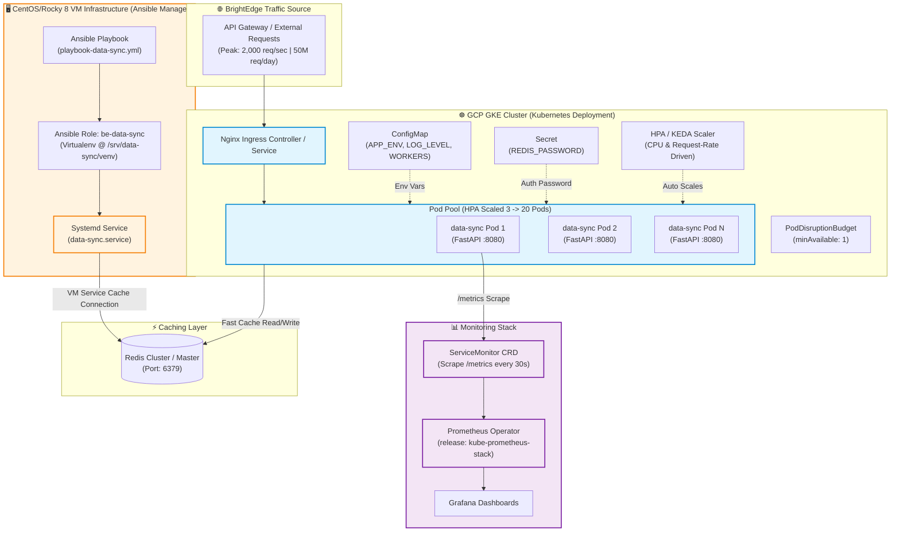
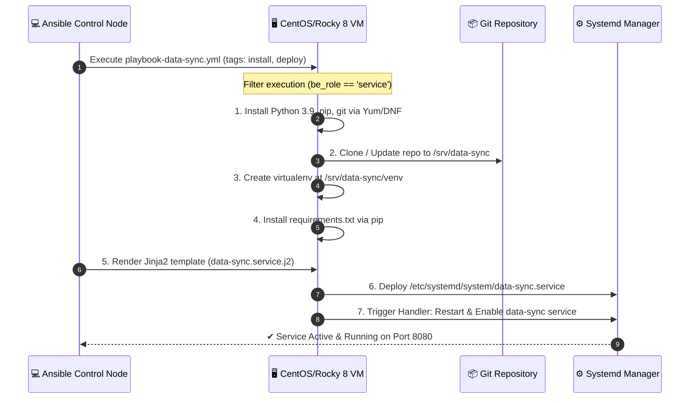

# 🚀 BrightEdge Platform — `data-sync` Microservice Integration

[](https://kubernetes.io/)
[](https://helm.sh/)
[](https://www.ansible.com/)
[](https://cloud.google.com/kubernetes-engine)
[](https://fastapi.tiangolo.com/)
[](https://prometheus.io/)

Production-grade DevOps deployment platform for BrightEdge's **`data-sync`** high-throughput Python FastAPI microservice. Manages containerized GKE workloads via Helm & Kustomize and VM-based workloads via Ansible roles and playbooks.

---

## 🏗️ End-to-End Platform Architecture

The diagram below illustrates how the **`data-sync`** microservice operates across both **GKE Kubernetes Clusters** and **Ansible-Managed VM Infrastructure**, connecting to Redis caching layers and Prometheus monitoring:



---

## 📂 Repository Directory Structure

```
.
├── helm/
│   └── charts/
│       └── data-sync/
│           ├── Chart.yaml                  # Helm v2 Chart metadata
│           ├── values.yaml                 # Safe defaults (Local/Development)
│           ├── values.staging.yaml         # Staging configuration (2 Replicas, INFO log)
│           ├── values.production.yaml      # Production config (HPA min 3 / max 20, strict limits)
│           └── templates/
│               ├── _helpers.tpl            # Template helpers & standard label generators
│               ├── deployment.yaml         # Deployment with probes, securityContext & env vars
│               ├── service.yaml            # ClusterIP Service exposing port 8080
│               ├── configmap.yaml          # ConfigMap for non-sensitive settings
│               ├── secret.yaml             # Opaque Secret for REDIS_PASSWORD
│               ├── hpa.yaml                # HorizontalPodAutoscaler (autoscaling/v2)
│               ├── pdb.yaml                # PodDisruptionBudget (minAvailable: 1)
│               └── servicemonitor.yaml     # Prometheus Operator ServiceMonitor CRD
├── standard/
│   └── data-sync/
│       └── production/
│           ├── kustomization.yaml          # Kustomize overlay referencing Helm base
│           └── deployment-patch.yaml       # GCP Zone topologySpreadConstraint & SECRET_CHECKSUM
├── roles/
│   └── be-data-sync/
│       ├── defaults/main.yml            # Default role variables
│       ├── handlers/main.yml            # Systemd service restart handler
│       ├── tasks/main.yml               # Yum/DNF install, git clone, venv, systemd tasks
│       ├── templates/
│       │   └── data-sync.service.j2    # Jinja2 template for data-sync.service
│       └── meta/main.yml                # Role metadata (CentOS/Rocky EL 8)
├── playbooks/
│   └── playbook-data-sync.yml              # Ansible playbook targeting 'service' group
├── group_vars/
│   └── service.yml                         # Group variables for 'service' VMs
├── DESIGN.md                               # Architectural design document (Scaling, Isolation, Secrets)
└── README.md                               # Platform documentation & operational guide
```

---

## ⚙️ Environment Configuration Matrix

The table below outlines how configuration values are mapped across different environments:

| Parameter | Development (`values.yaml`) | Staging (`values.staging.yaml`) | Production (`values.production.yaml`) |
| :--- | :--- | :--- | :--- |
| **Replicas** | `1` (Fixed) | `2` (Fixed) | `3` Min / `20` Max (HPA Enabled) |
| **Log Level** | `DEBUG` | `INFO` | `INFO` |
| **CPU Request / Limit** | `100m` / `250m` | `250m` / `500m` | `500m` / `1000m` |
| **Memory Request / Limit**| `128Mi` / `256Mi` | `256Mi` / `512Mi` | `512Mi` / `1Gi` |
| **Redis Host** | `redis-master.data-sync.svc.cluster.local` | `redis-staging.data-sync.svc.cluster.local` | `redis-prod.data-sync.svc.cluster.local` |
| **HPA Target CPU** | Disabled | Disabled | `70%` Target Utilization |
| **Zone Spreading** | Default Kubernetes Scheduling | Default Kubernetes Scheduling | Enforced via Kustomize `topologySpreadConstraint` |

---

## ☸️ Part 1: Helm Chart & Kustomize Deployment

### 1. Helm Chart Linting & Validation

To validate the Helm chart syntax and structure locally:

```bash
# Lint the Helm chart for syntax correctness
helm lint helm/charts/data-sync
```

To render and inspect standard Kubernetes manifests for each environment:

```bash
# Preview Development manifests
helm template data-sync helm/charts/data-sync

# Preview Staging manifests
helm template data-sync helm/charts/data-sync -f helm/charts/data-sync/values.staging.yaml

# Preview Production manifests
helm template data-sync helm/charts/data-sync -f helm/charts/data-sync/values.production.yaml
```

---

### 2. Staging Deployment Workflow

> [!NOTE]
> Ensure your active `kubectl` context points to the target Staging cluster.

```bash
# 1. Create Staging Namespace if it doesn't exist
kubectl create namespace data-sync-staging --dry-run=client -o yaml | kubectl apply -f -

# 2. Deploy / Upgrade data-sync in Staging
helm upgrade --install data-sync helm/charts/data-sync \
  --namespace data-sync-staging \
  -f helm/charts/data-sync/values.staging.yaml \
  --set secret.redisPassword="$STAGING_REDIS_PASSWORD" \
  --wait
```

---

### 3. Production Deployment Workflow

#### Option A: Direct Helm Deployment
```bash
# 1. Create Production Namespace
kubectl create namespace data-sync-prod --dry-run=client -o yaml | kubectl apply -f -

# 2. Deploy / Upgrade data-sync in Production
helm upgrade --install data-sync helm/charts/data-sync \
  --namespace data-sync-prod \
  -f helm/charts/data-sync/values.production.yaml \
  --set secret.redisPassword="$PROD_REDIS_PASSWORD" \
  --wait
```

#### Option B: Production Kustomize Overlay Deployment
The production overlay applies GCP zone spreading (`topologySpreadConstraint`) and automatic secret rollout triggers (`SECRET_CHECKSUM`).

```bash
# Preview Production Kustomize Overlay Output
kubectl kustomize standard/data-sync/production

# Apply Production Overlay to GKE Cluster
kubectl kustomize standard/data-sync/production | kubectl apply -n data-sync-prod -f -
```

---

## 🔧 Part 2: Ansible VM Infrastructure (`be-data-sync`)

### Ansible Provisioning Architecture



### Execution Commands

```bash
# 1. Run Playbook Syntax Check
ansible-playbook playbooks/playbook-data-sync.yml --syntax-check

# 2. Run Ansible-Lint
ansible-lint playbooks/playbook-data-sync.yml roles/be-data-sync/

# 3. Deploy full installation on 'service' host group
ansible-playbook -i inventory.ini playbooks/playbook-data-sync.yml --tags "install,deploy"

# 4. Deploy configuration update only
ansible-playbook -i inventory.ini playbooks/playbook-data-sync.yml --tags "deploy"
```

---

## 📐 Part 3: Architectural Design Highlights (`DESIGN.md`)

The comprehensive design document [DESIGN.md](file:///c:/Users/ROHIT/Desktop/Devops%20task%20Brightedge/DESIGN.md) addresses high-scale challenges (50M req/day, 2000 req/s burst):

> [!IMPORTANT]
> **Sub-20s Scale-Out Lag**: Solved by implementing **KEDA (Kubernetes Event-driven Autoscaling)** using HTTP request rate leading metrics, aggressive HPA step-up scaling, GKE Image Streaming, and scheduled baseline pre-warming.

> [!TIP]
> **Noisy Neighbour Workload Isolation**: Solved using dedicated GKE node pools (`api-pool`), Node Taints & Tolerations (`workload=data-sync:NoSchedule`), Node Affinity, `Guaranteed` QoS class (Static CPU Manager), and `PriorityClasses`.

> [!WARNING]
> **Zero-Downtime Secret Rotation**: Solved using dual-password authentication in Redis & FastAPI, External Secrets Operator / Reloader delivery, rolling update strategy (`maxUnavailable: 0`), and active health verification.

